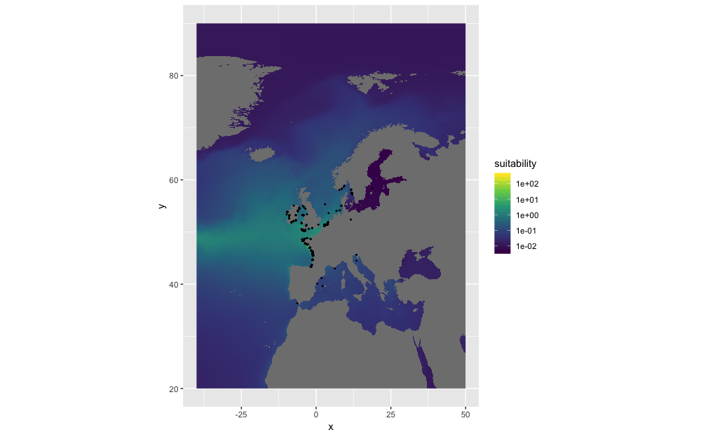

# findingdemo

## How to
#### Fetch WRiMS species list

```r
sp <- get_wrims_species
```

#### Fetch temperature and salinity raster data

```r
temp <- get_temperature()
sal <- get_salinity()
```

#### Extract raster data

```r
t <- extract_raster(temp, 0, 55)
```

#### Fetch occurrence data for an AphiaID

```r
occ <- get_occurrence(159559)
```

#### Create habitat suitability maps

```r
occ <- get_occurrence(232032)
temp <- get_biooracle_temperature()
sal <- get_biooracle_salinity()

plot_niche(occ, temp, sal)
hs <- make_suitability(occ, temp, sal)

df <- as.data.frame(hs, xy = TRUE)
ggplot() +
    geom_raster(data = df, aes(x = x, y = y, fill = suitability)) +
    scale_fill_viridis_c(trans = "exp") +
    coord_quickmap() +
    geom_point(data = occ, aes(x = longitude, y = latitude), size = 0.3)
```



#### Launch shiny app

```r
launch_app()
```

## Test species

```
107451 Eriocheir sinensis
129884 Heteromastus filiformis
144476 Caulerpa taxifolia
138963 Crepidula fornicata
876640 Ensis leei
140416 Rapana venosa
233889 Paralithodes camtschaticus
160585 Heterosigma akashiwo
103732 Ciona intestinalis
232032 Rhopilema nomadica
```
