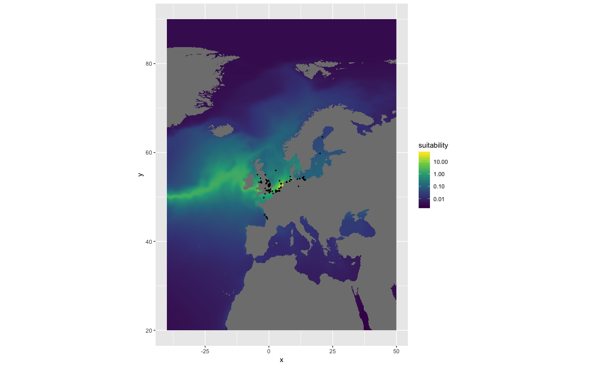

# findingdemo

## How to
#### fetch WRiMS species list

```r
sp <- get_wrims_species
```

#### fetch temperature and salinity raster data

```r
temp <- get_temperature()
sal <- get_salinity()
```

#### extract raster data

```r
t <- extract_raster(temp, 0, 55)
```

#### fetch occurrence data for an AphiaID

```r
occ <- get_occurrence(159559)
```

#### create habitat suitability maps

```r
hs <- make_suitability(occ, temp, sal)

df <- as.data.frame(hs, xy = TRUE) %>%
  mutate(suitability = 1 / layer)
ggplot() +
    geom_raster(data = df, aes(x = x, y = y, fill = suitability)) +
    scale_fill_viridis_c(trans = "log10") +
    coord_quickmap()
```



#### launch shiny app

```r
launch_app()
```
